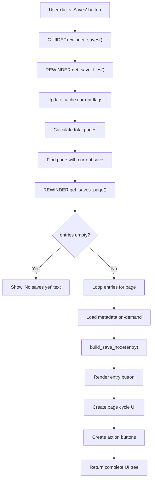

# Save List Render Flow

Triggered when user opens the Saves panel from Options menu.

---

## Entry Point

**`G.UIDEF.rewinder_saves()`** in `UI/RewinderUI.lua`

---

## Flow Diagram



---

## Step-by-Step

### Step 1: Load Entries

```lua
local entries = REWINDER.get_save_files()
```

**Actions:**
- Calls `SaveManager.get_save_files()`
- Updates `ENTRY_IS_CURRENT` flag on all entries
- Returns sorted entry array (newest first)

---

### Step 2: Calculate Pagination

```lua
local per_page = 8
local total_pages = math.max(1, math.ceil(#entries / per_page))
```

**Find initial page — O(1):**
- Uses `SaveManager.current_index` or `find_current_index()` (hash lookup)
- Calculate which page: `math.ceil(current_idx / per_page)`
- Open on that page (not always page 1)

---

### Step 3: Build Page Content — `get_saves_page()`

```lua
for i = 1, max_index do
   local entry = entries[offset + i]
   
   -- Lazy load metadata if needed
   if entry and not entry[ENTRY_SIGNATURE] then
      REWINDER.get_save_meta(entry)
   end
   
   table.insert(nodes, REWINDER.build_save_node(entry, is_first_entry, opts))
end
```

**Key behavior:**
- Loads only visible page entries (O(per_page), not O(N))
- Metadata loaded on-demand when entry is rendered
- Uses pre-computed `ENTRY_DISPLAY_TYPE` and `ENTRY_ORDINAL` (no computation)

---

### Step 4: Build Entry Node — `build_save_node(entry)`

**Entry format:** 12-field array (see `CACHE_ENTRY_EXAMPLE.md`)

**Rendering logic:**

| Field | Usage |
|-------|-------|
| `ENTRY_ANTE` | "Ante 2" text |
| `ENTRY_ROUND` | Round number with color (odd=yellow, even=orange) |
| `ENTRY_BLIND_IDX` | Blind sprite icon (if enabled) |
| `ENTRY_DISPLAY_TYPE` | State label lookup via `DISPLAY_TYPE_LABELS` table |
| `ENTRY_ORDINAL` | Tailing number (e.g., "Shop 3") |
| `ENTRY_IS_CURRENT` | Orange highlight + triangle arrow |
| `ENTRY_FILE` | Stored in button's `ref_table` for click callback |

**Fast path:** Uses lookup table for display_type → label (no computation)

---

### Step 5: Assemble Complete UI

Returns `create_UIBox_generic_options()` with:
1. Saves list box (scrollable)
2. Page cycle control (displays current page, allows navigation)
3. "Current save" jump button (jumps to page containing current save)
4. "Delete all" button

---

## Page Navigation & Jump to Current

### Page Update Flow (`rewinder_save_update_page`)

When user navigates pages or clicks "Current save":

1. **Update page content**: Replace saves box with new page entries
2. **Find DynaText ref_table**: Locate the actual config object that the page cycle display reads from
3. **Update all config references**: Update both `args.cycle_config` and the DynaText's ref_table (if different)
4. **Force UI recalculation**: Trigger cycle node recalculation to update displayed page number

**Key optimization:**
- Avoids loop if `cycle_args == args.cycle_config` (they're the same reference)
- Direct assignment instead of iterating when references differ

### Jump to Current (`rewinder_save_jump_to_current`)

1. Find current save index via `find_current_index()` (O(1) hash lookup)
2. Calculate target page: `math.ceil(index / per_page)`
3. Call `rewinder_save_update_page()` with target page
4. Snap focus to current save entry after page update

**Performance:**
- O(1) current index lookup (not O(N) scan)
- Direct page calculation (not loop)

---

## Performance Notes

| Aspect | Optimization |
|--------|-------------|
| Current flag update | **O(1)** via change detection + hash lookup (not O(N) loop) |
| Initial page lookup | **O(1)** via `current_index` (not O(N) entry scan) |
| Entry loading | O(per_page) not O(N) |
| Metadata | Lazy-loaded only when visible |
| Display labels | Lookup table (no string formatting) |
| Blind sprites | Config cached, sprites created on-demand |

---

## Related Files

- `UI/RewinderUI.lua` — UI rendering
- `UI/ButtonCallbacks.lua` — Click handlers
- `Core/SaveManager.lua` — Entry data and `get_save_files()`
- `CACHE_ENTRY_EXAMPLE.md` — Entry field structure
